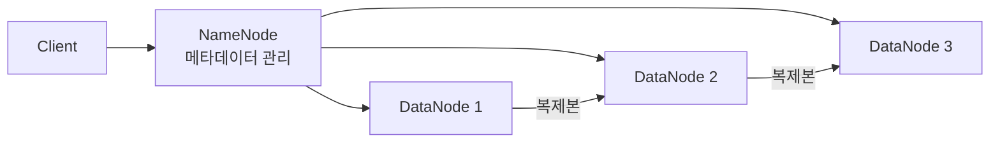
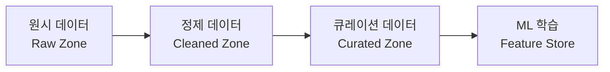

## MLOps 구현을 위한 인프라와 도구: Storage와 Computing

> AI 부트캠프 MLOps 파트  
> MLOps 구현을 위한 핵심 인프라 구성 요소 정리

---

### 개요

MLOps는 머신러닝 모델의 개발부터 배포, 운영까지의 전체 라이프사이클을 자동화하고 관리하는 체계입니다. 이를 위해서는 **데이터를 저장·관리하는 Storage**와 **연산을 수행하는 Computing** 인프라가 필수적입니다.


---

## 1. Storage

MLOps에서 **Storage**는 데이터 저장, 관리, 검색을 담당하며, 데이터의 안정성·접근성·확장성을 보장하는 핵심 인프라입니다.

### 1.1 Storage가 중요한 이유

| 관점 | 설명 |
| --- | --- |
| **데이터 보존** | 학습 데이터, 모델 아티팩트, 실험 로그 등의 안전한 보존 |
| **접근성** | 팀 전체가 데이터에 효율적으로 접근하고 공유 가능 |
| **확장성** | 데이터 양 증가에 따라 유연하게 스케일 아웃 가능 |
| **재현성** | 데이터 버전 관리를 통한 실험 재현 보장 |

---

### 1.2 Storage 유형별 비교

#### 클라우드 스토리지 (Object Storage)

대표적인 오브젝트 스토리지로, 거의 무한한 저장 공간과 높은 내구성·가용성을 제공합니다.

| 서비스 | 제공사 | 특징 |
| --- | --- | --- |
| **Amazon S3** | AWS | 99.999999999% 내구성, 다양한 스토리지 클래스 |
| **Google Cloud Storage** | GCP | 통합 분석 파이프라인, 멀티 리전 지원 |
| **Azure Blob Storage** | Azure | 핫/쿨/아카이브 티어, Azure 생태계 통합 |

```bash
# AWS S3 사용 예시 - 학습 데이터 업로드
$ aws s3 cp ./training-data/ s3://my-ml-bucket/data/ --recursive

# 모델 아티팩트 다운로드
$ aws s3 cp s3://my-ml-bucket/models/v1.0/model.pkl ./models/
```

**MLOps 활용 포인트:**
- 학습 데이터셋 저장 및 버전 관리
- 모델 체크포인트 자동 백업
- 파이프라인 중간 결과물 캐싱

---

#### 분산 파일 시스템 (Distributed File System)

대규모 데이터를 여러 노드에 분산 저장하여 고가용성과 병렬 처리를 제공합니다.

| 시스템 | 특징 |
| --- | --- |
| **HDFS** | Hadoop 생태계 기반, 대규모 배치 처리에 최적화 |
| **GlusterFS** | 소프트웨어 정의 스토리지, 유연한 확장 |
| **Ceph** | 블록/오브젝트/파일 스토리지 통합, 자가 복구 |



**MLOps 활용 포인트:**
- 대규모 비정형 데이터(이미지, 동영상) 분산 저장
- Spark/Hadoop과 연계한 대규모 데이터 전처리
- 고가용성 데이터 파이프라인 구축

---

#### 데이터 웨어하우스 (Data Warehouse)

구조화된 대용량 데이터의 고속 쿼리 실행 및 분석에 최적화된 저장소입니다.

| 서비스 | 특징 |
| --- | --- |
| **Snowflake** | 컴퓨팅/스토리지 분리, 자동 스케일링, 데이터 공유 |
| **Amazon Redshift** | 컬럼 기반 저장, 병렬 쿼리 처리 |
| **Google BigQuery** | 서버리스, 페타바이트 규모 분석, ML 통합 (BQML) |

```sql
-- BigQuery에서 학습 데이터 준비 예시
SELECT
  user_id,
  feature_1,
  feature_2,
  label
FROM `project.dataset.training_table`
WHERE created_at >= '2026-01-01'
  AND is_valid = TRUE
ORDER BY RAND()
LIMIT 100000;
```

**MLOps 활용 포인트:**
- Feature Store 구축 및 피처 엔지니어링
- 모델 성능 메트릭 저장 및 분석
- A/B 테스트 결과 데이터 관리

---

#### 데이터 레이크 (Data Lake)

다양한 형식(비/반/구조화)의 대규모 데이터를 원본 그대로 저장·관리합니다.

| 서비스 | 특징 |
| --- | --- |
| **AWS Lake Formation** | S3 기반, 데이터 카탈로그, 보안 관리 |
| **Azure Data Lake** | 계층적 네임스페이스, ADLS Gen2 |
| **Delta Lake** | ACID 트랜잭션, 스키마 진화, 타임 트래블 |



**MLOps 활용 포인트:**
- 원시 데이터부터 피처까지 전체 데이터 계보(Lineage) 추적
- 다양한 데이터 소스(로그, IoT, 이미지 등) 통합 관리
- 데이터 버전 관리 및 타임 트래블

---

### 1.3 Storage 유형 비교 요약

| 유형 | 데이터 형식 | 규모 | 쿼리 속도 | 주요 사용 사례 |
| --- | --- | --- | --- | --- |
| 클라우드 스토리지 | 비정형 | 무제한 | - | 모델/데이터 저장, 백업 |
| 분산 파일 시스템 | 비정형 | PB급 | 중간 | 대규모 배치 처리 |
| 데이터 웨어하우스 | 구조화 | PB급 | 빠름 | 분석, 피처 엔지니어링 |
| 데이터 레이크 | 혼합 | 무제한 | 중간 | 원시 데이터 통합 관리 |

---

## 2. Computing

**Computing**은 데이터 처리, 모델 트레이닝 및 추론에 필요한 컴퓨팅 파워를 제공하며, 높은 성능과 확장 가능한 리소스를 보장합니다.

### 2.1 Computing이 중요한 이유

| 관점 | 설명 |
| --- | --- |
| **성능** | 높은 컴퓨팅 파워로 복잡한 연산 빠르게 처리 |
| **유연성** | 다양한 워크로드(학습, 추론, 전처리)에 맞는 리소스 선택 |
| **확장성** | 프로젝트 요구에 따른 리소스 확장/축소 (Scale Up/Out) |
| **비용 효율성** | 사용한 만큼만 과금, 유휴 리소스 최소화 |

---

### 2.2 Computing 유형별 비교

#### 클라우드 기반 컴퓨팅 (Cloud VM)

가상 머신 기반의 범용 컴퓨팅 리소스를 제공합니다.

| 서비스 | 제공사 | 특징 |
| --- | --- | --- |
| **Amazon EC2** | AWS | 다양한 인스턴스 유형, 스팟 인스턴스 지원 |
| **Google Compute Engine** | GCP | 커스텀 머신 타입, 선점형 VM |
| **Azure Virtual Machines** | Azure | 하이브리드 클라우드, 전용 호스트 |

```bash
# AWS EC2 GPU 인스턴스 시작 예시
$ aws ec2 run-instances \
    --image-id ami-0abcdef1234567890 \
    --instance-type p3.2xlarge \
    --key-name my-key-pair \
    --tag-specifications 'ResourceType=instance,Tags=[{Key=Name,Value=ML-Training}]'
```

**MLOps 활용 포인트:**
- 커스텀 ML 학습 환경 구축
- 자동 스케일링으로 수요에 따른 리소스 관리
- 스팟/선점형 인스턴스로 학습 비용 절감 (최대 90%)

---

#### GPU / TPU 컴퓨팅

딥러닝 작업에 최적화된 전용 가속기입니다.

| 하드웨어 | 특징 |
| --- | --- |
| **NVIDIA A100** | 80GB HBM2e, Tensor Core, 멀티 인스턴스 GPU |
| **NVIDIA H100** | Hopper 아키텍처, Transformer 엔진, 4세대 Tensor Core |
| **Google Cloud TPU** | ML 전용 설계, 대규모 행렬 연산 최적화 |

```python
# PyTorch에서 GPU 활용 예시
import torch

device = torch.device('cuda' if torch.cuda.is_available() else 'cpu')
print(f"사용 디바이스: {device}")

# 모델과 데이터를 GPU로 이동
model = MyModel().to(device)
data = data.to(device)

# 멀티 GPU 분산 학습
if torch.cuda.device_count() > 1:
    model = torch.nn.DataParallel(model)
```

**GPU vs TPU 비교:**

| 항목 | GPU (NVIDIA) | TPU (Google) |
| --- | --- | --- |
| 설계 목적 | 범용 병렬 처리 | ML 전용 |
| 메모리 | HBM2e (40~80GB) | HBM (8~128GB) |
| 프레임워크 | PyTorch, TensorFlow 등 | TensorFlow, JAX 최적화 |
| 비용 | 상대적으로 유연 | 대규모 학습 시 효율적 |

**MLOps 활용 포인트:**
- 대규모 딥러닝 모델 학습 (LLM, Vision 등)
- 분산 학습으로 학습 시간 단축
- 실시간 추론 서빙에 활용

---

#### 서버리스 컴퓨팅 (Serverless)

서버 관리 없이 코드 실행에 집중할 수 있는 이벤트 기반 컴퓨팅입니다.

| 서비스 | 제공사 | 특징 |
| --- | --- | --- |
| **AWS Lambda** | AWS | 최대 15분 실행, 다양한 트리거, 컨테이너 이미지 지원 |
| **Google Cloud Functions** | GCP | HTTP/이벤트 트리거, 자동 스케일링 |
| **Azure Functions** | Azure | Durable Functions, 다양한 호스팅 플랜 |

```python
# AWS Lambda를 활용한 추론 핸들러 예시
import json
import boto3

def lambda_handler(event, context):
    # 요청 데이터 파싱
    body = json.loads(event['body'])
    input_data = body['features']
    
    # SageMaker 엔드포인트 호출
    runtime = boto3.client('sagemaker-runtime')
    response = runtime.invoke_endpoint(
        EndpointName='my-model-endpoint',
        ContentType='application/json',
        Body=json.dumps({'instances': [input_data]})
    )
    
    prediction = json.loads(response['Body'].read().decode())
    
    return {
        'statusCode': 200,
        'body': json.dumps({'prediction': prediction})
    }
```

**MLOps 활용 포인트:**
- 경량 모델의 실시간 추론 API
- 데이터 전처리 트리거 (S3 업로드 → 자동 전처리)
- 모델 모니터링 알림 및 알람 처리

---

#### 컨테이너화된 컴퓨팅 (Container Orchestration)

개발~배포 전 과정에서 환경 일관성을 보장하고 자동 오케스트레이션을 제공합니다.

| 도구 | 특징 |
| --- | --- |
| **Docker** | 컨테이너 이미지 빌드, 환경 격리, 이식성 |
| **Kubernetes** | 자동 스케일링, 셀프 힐링, 롤링 업데이트 |
| **Amazon EKS** | 관리형 K8s, AWS 서비스 통합 |
| **Google GKE** | Autopilot 모드, AI/ML 워크로드 최적화 |

```dockerfile
# ML 추론 서버 Docker 이미지 예시
FROM python:3.11-slim

WORKDIR /app

COPY requirements.txt .
RUN pip install --no-cache-dir -r requirements.txt

COPY model/ ./model/
COPY app.py .

EXPOSE 8080

CMD ["uvicorn", "app:app", "--host", "0.0.0.0", "--port", "8080"]
```

```yaml
# Kubernetes에서 ML 모델 서빙 배포 예시
apiVersion: apps/v1
kind: Deployment
metadata:
  name: ml-inference-server
spec:
  replicas: 3
  selector:
    matchLabels:
      app: ml-inference
  template:
    metadata:
      labels:
        app: ml-inference
    spec:
      containers:
        - name: inference
          image: my-registry/ml-model:v1.0
          ports:
            - containerPort: 8080
          resources:
            requests:
              cpu: "500m"
              memory: "1Gi"
            limits:
              nvidia.com/gpu: 1
```


**MLOps 활용 포인트:**
- 학습/추론 환경의 재현 가능한 패키징
- 모델 서빙 자동 스케일링 (트래픽 기반)
- CI/CD 파이프라인과 통합한 자동 배포

---

### 2.3 Computing 유형 비교 요약

| 유형 | 관리 부담 | 확장성 | 비용 모델 | 주요 사용 사례 |
| --- | --- | --- | --- | --- |
| 클라우드 VM | 중간 | 수동/자동 | 시간당 과금 | 커스텀 학습 환경 |
| GPU/TPU | 낮음~중간 | 수동 | 시간당 과금 | 딥러닝 학습·추론 |
| 서버리스 | 낮음 | 자동 | 요청당 과금 | 경량 추론, 트리거 |
| 컨테이너/K8s | 중간~높음 | 자동 | 리소스 기반 | 모델 서빙, CI/CD |

---

## 3. Storage + Computing 통합 아키텍처

실제 MLOps 환경에서는 Storage와 Computing을 조합하여 **end-to-end ML 파이프라인**을 구성합니다.


### 주요 통합 포인트

| 단계 | Storage | Computing |
| --- | --- | --- |
| 데이터 수집 | Data Lake, Object Storage | 서버리스 (이벤트 트리거) |
| 전처리 | 분산 파일 시스템 | Spark 클러스터, 서버리스 |
| 피처 엔지니어링 | 데이터 웨어하우스 | SQL 엔진, 클라우드 VM |
| 모델 학습 | Object Storage (체크포인트) | GPU/TPU 클러스터 |
| 모델 저장 | 모델 레지스트리 (S3 등) | - |
| 모델 서빙 | Object Storage | K8s, 서버리스 |
| 모니터링 | 데이터 웨어하우스 (메트릭) | 서버리스 (알림) |

---

### 정리

MLOps 인프라의 핵심은 **적절한 Storage와 Computing의 조합**입니다.

| 핵심 요소 | 기억할 점 |
| --- | --- |
| **Storage** | 데이터 특성(구조화/비정형)에 따라 적합한 저장소 선택 |
| **Computing** | 워크로드 특성(학습/추론/전처리)에 따라 컴퓨팅 리소스 선택 |
| **비용 최적화** | 스팟 인스턴스, 서버리스, 스토리지 티어링으로 비용 절감 |
| **자동화** | IaC(Terraform 등)로 인프라를 코드로 관리하여 재현성 확보 |

> **Tip**: MLOps 파이프라인 설계 시 **데이터 규모**, **실시간성 요구사항**, **비용 예산**을 먼저 파악한 후 인프라를 선택하세요.  
> 소규모 프로젝트라면 서버리스 + 오브젝트 스토리지로 시작하고, 규모가 커지면 K8s + 분산 스토리지로 전환하는 전략이 효과적입니다.
